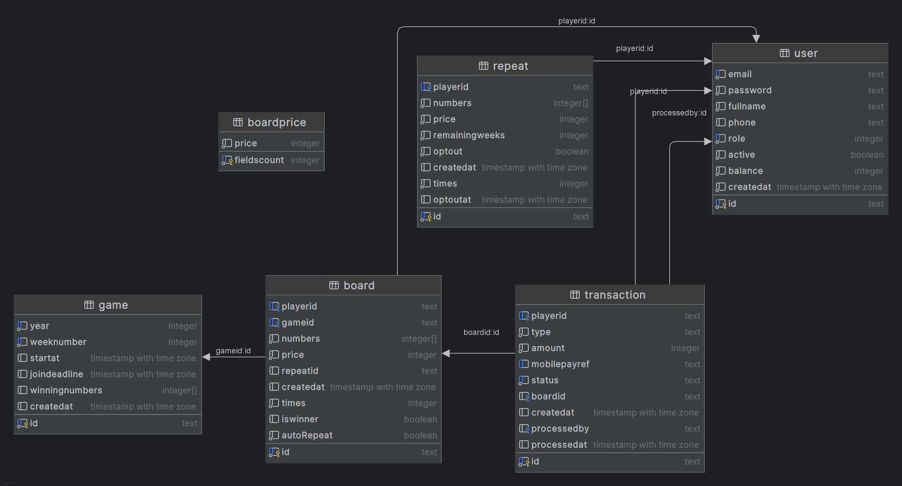

# Dead Pigeons 🐦 (3rd Semester Project)

- [Dead Pigeons](#dead-pigeons)
    - [Live demo](#live-demo)
        - [Run API](#run-api)
        - [Run Client](#run-client)
        - [Run Tests](#run-tests)
    - [Prerequisites](#prerequisites)
    - [Environment](#environment)
    - [Configuration](#configuration)
        - [API configuration](#api-configuration)
        - [Client configuration](#client-configuration)
        - [Testing](#testing)
            - [How we test](#how-we-test)
    - [Linting](#linting)
    - [Authentication](#authentication)
    - [JWT](#jwt)
    - [Authorization](#authorization)
        - [Anonymous (not logged in)](#anonymous-not-logged-in)
        - [Authenticated user (role = Player or Admin)](#authenticated-user-role--player-or-admin)
        - [Player only (role = Player)](#player-only-role--player)
        - [Admin only (role = Admin)](#admin-only-role--admin)
    - [Architecture / Data model](#architecture--data-model)
    - [Deployment](#deployment)
        - [Proxy & Frontend Integration](#proxy--frontend-integration)
    - [Limitations](#limitations)

## Dead Pigeons
This project was developed for the local sports club, Jerne IF.
It delivers a web-based solution that digitizes the game workflow,
making it easier to operate the game, manage players and boards,
and scale as participation grows.
Our project has Mobile-friendly UI (responsive layout for phone/tablet).

## Live demo
- https://deadpigeons-frontend.fly.dev
  email and password are stored in Wiseflow.

### Run API
From repo root (adjust paths if yours differ):
```bash
cd server/api
dotnet run
```
### Run Client
```bash
cd client
npm install
npm run dev
```
### Run Tests
```bash
cd server/tests
dotnet test
```

## Prerequisites
- .NET SDK **9.x**
- Node.js
- PostgreSQL (Neon db)
- Fly.io CLI + Fly.io account (deployment)
- Docker (for running PostgreSQL locally and for deployment)
- GitHub account (for CI/CD)

## Environment
Full-stack lottery web application with:
- api: ASP.NET Core (.NET 9), EF Core + PostgreSQL
- client: React + TypeScript + Tailwind CSS
- tests: xUnit + Testcontainers + XUnit.DependencyInjection
- CI: GitHub Actions (build + tests)
- deployment: Docker + Fly.io
- infrastructure: Fly.io + PostgreSQL (Neon)
- querying: sieve (filter/sort/paging)
- authentication: JWT access tokens
- documentation: Swagger / OpenAPI

## Configuration
### API configuration
- Configuration values (connection string and Jwt secret) are read from `server/api/appsettings.json`.
- Swagger is enabled (please see `server/api/Program.cs`).
- Sieve is enabled for selected list endpoints (filter/sort/paging via query parameters using `SieveModel`).

### Client configuration
- `VITE_API_URL` is stored in `client/.env`.
- Build modes: development vs production (Vite).
- Proxy settings for local development are configured in `client/vite.config.ts`.

### Testing
#### How we test
- xUnit tests for service methods (happy path + unhappy path).
- Testcontainers for isolated PostgreSQL persistence.
- XUnit.DependencyInjection for test setup / DI wiring.

## Linting
Client linting is handled with ESLint (TypeScript + React rules).
`eslint.config.js` contains the configuration.
The client uses ESLint (v9 “flat config”) with TypeScript + React rules.

- Config: `client/eslint.config.js`
- Run lint:
    - `cd client`
    - `npm run lint`
- Ignored:
    - `dist/`
- Rules include:
    - `@eslint/js`
    - `typescript-eslint`
    - `eslint-plugin-react-hooks`
    - `eslint-plugin-react-refresh` (Vite)

## Authentication
The API uses email + password login.
- Users log in with **email** and **password**.
- Passwords are hashed with **Argon2id** and never stored in plain text.
- On successful login, the API issues a **JWT access token**.
- The client must send the JWT with subsequent requests (typically in the `Authorization: Bearer <token>` header).

## JWT
JWT access token details:
- Contains claims:
    - `sub` = user ID
    - `role` = user role (Admin / Player)
- Signed using **HMAC-SHA256**
- Valid for **8 hours**
- Automatically validated by ASP.NET middleware:
    - signature validation
    - expiration validation

## Authorization
We use role-based authorization policies (Admin / Player) and in some cases
resource-based rules (a Player can only access their own data).

### Anonymous (not logged in)
No token required:
- `POST /api/auth/login` (login)

### Authenticated user (role = Player or Admin)
Users must be logged in (JWT required).

**Boards**
- `GET /api/board/user/{userId}` (player = only own boards; admin = any user)

**Board prices**
- `GET /api/BoardPrice` (accessible when logged in)

**Game results**
- `GET /api/games/draw/history` (view past winning draws)

### Player only (role = Player)
Players must be authenticated.

**Boards**
- `GET /api/board/user/{userId}` (view own boards only)
- `POST /api/board/user/purchase` (purchase boards for self only)
- `PUT /api/board/{boardId}/auto-repeat` (set auto-repeat for own board only)
- `GET /api/board/purchase/status` (view own purchase status only)

**Repeats**
- `GET /api/repeat/me` (own repeats only)
- `POST /api/repeat` (create repeat for self only)
- `POST /api/repeat/{id}/stop` (stop own repeat only)

**Transactions**
- `POST /api/Transaction/deposit` (create deposit for self only)
- `GET /api/Transaction/user/{userId}` (view own transactions only)

### Admin only (role = Admin)
Admins must be authenticated.

**Admin game management**
- `POST /api/admin/games/draw` (trigger draw)
- `GET /api/admin/games/draw/status` (view draw status)
- `GET /api/admin/games/winners/summary` (view winners summary)
- `GET /api/admin/games/draw/history` (view draw history)

**Users**
- `POST /api/user` (create user)
- `PATCH /api/user/{id}/activate` (activate user)
- `PATCH /api/user/{id}/deactivate` (deactivate user)
- `GET /api/user` (view all users)

**Boards**
- `GET /api/board/admin/all` (view all boards)
- `GET /api/board/user/{userId}` (admin can view any user’s boards)

**Transactions**
- `GET /api/Transaction/pending` (view pending transactions)
- `PUT /api/Transaction/{id}/status` (approve/reject transaction)

## Architecture / Data model
> Data model diagram:


## Deployment
**The backend is deployed using Docker and Fly.io.**
- The API is built with a multi-stage Docker build
- A lightweight ASP.NET runtime image is used in production
- Deployed to Fly.io in the fra region
- Runs on port 8080 with HTTPS enforced
- Fly.io manages TLS, scaling, and machine lifecycle
  ** Configuration
- Database connection and JWT secret are provided via AppSettings
- In production, secrets are supplied using environment variables / Fly.io secrets

### Proxy & Frontend Integration
- Frontend runs on http://localhost:5173
- API requests are proxied to the backend
- CORS allows the local frontend origin
**Production**
- Frontend and backend are hosted separately
- Backend is accessed over HTTPS via Fly.io
- CORS allows only the production frontend domain
  This setup ensures secure and smooth communication in both development and production environments.

## Limitations
- **No rate limiting / brute-force protection.**
  Login endpoint does not implement throttling, lockout, or captcha, so it’s not hardened against repeated attempts.
- **No email verification / password reset.**
  User registration does not include email verification or “forgot password” functionality.
- **No internationalization (i18n).**
  The client UI does not support multiple languages.

